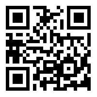

# qr-madness
# Description
In this task, you are presented with several images, where some of them comprise a QR code. When placed together they form this . When scanned, they present you with the flag: KID20{woW_ar3_y0u_a_W1z4rD?}