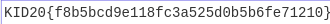

# zipomania
## Description

The first thing one might try here is to unzip until you come to the bottom. If you try that, you will not succeed as this is based on a [self-containing zip-file](https://research.swtch.com/zip).

Now, what? Let's look at the size of the zip as we unzip. We would then see that the zip suddenly goes from 6399 bytes to 440 bytes. When the zip-file has reached 440 bytes, the file stays at 440 bytes.

This would suggest that one might look closer on the 6399 bytes file, as a lot of information seems to be lost when unzipping this file. Using binwalk, we can see what the file consist of:

```
root@kali:~/Documents/kidctf/zip# binwalk r.zip 

DECIMAL       HEXADECIMAL     DESCRIPTION
--------------------------------------------------------------------------------
0             0x0             Zip archive data, at least v2.0 to extract, compressed size: 328, uncompressed size: 440, name: r/r.zip
418           0x1A2           End of Zip archive, footer length: 22
440           0x1B8           PNG image, 330 x 24, 8-bit/color RGBA, non-interlaced
588           0x24C           Zlib compressed data, default compression
```

It does seem like there is a png-image concatinated to this zip-file?

Using dd, we can copy this png-data into a new png-file:

```
root@kali:~/Documents/kidctf/zip# dd if=r.zip of=out.png bs=1 skip=440
5959+0 records in
5959+0 records out
5959 bytes (6.0 kB, 5.8 KiB) copied, 0.0233399 s, 255 kB/s
```

Opening `out.png` gives us the flag:

