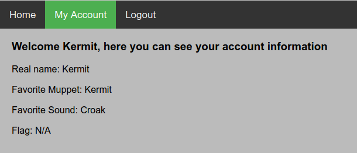

# cookie-monster:
## Description:
In this challenge we were given the URL to a muppet fanpage create by the famous Cookie Monster. 
The web pages hints to the cookie as the source of the weakness in the web-app. We therefore start by registring an account on the web page. Once we register an account and login we see that an account page becomes available in the top navigation bar. By entering the account page we get the following:
</br>
We here see that our account has a flag attribute, however, it is stated as *Not Applicable* for our account. Now, we can try and change the cookie value and see what happens. By changing the cookie value from *Kermit* to *admin* and updating the page we can see that the flag attribute is no longer *Not Applicable* but rather: 
```
KID20{y0u_d35Rve_A_c0oki3}
```
